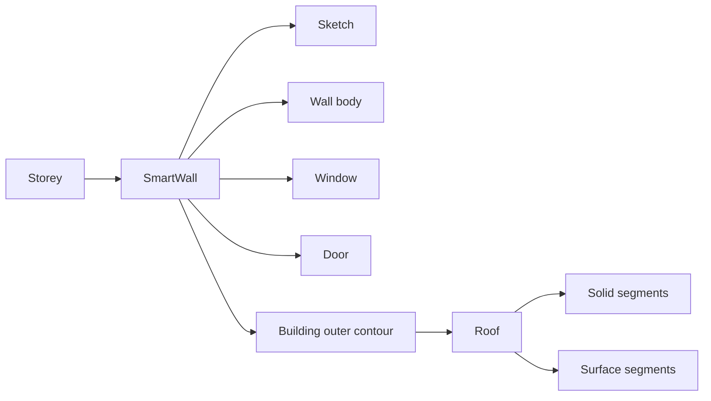

# Архитектурные объекты: SmartWall и Roof

Статус: `Гипотеза` для реализации, предметная модель стены подтверждена  
Дата фиксации: 2026-08-26  
Источник: опыт предыдущей версии и текущая архитектура Dom3D Pro

## SmartWall

Стена должна быть представлена составным объектом `SmartWall`, а не отдельным
геометрическим примитивом.

```text
SmartWall
├── Sketch
├── Wall body
├── Window[]
└── Door[]
```

- `Sketch` задаёт траекторию стены и является её геометрической основой.
- `Wall body` — перестраиваемое твёрдое тело стены.
- Окна и двери принадлежат стене и хранят привязку к её локальной системе.
- Изменение эскиза должно перестраивать тело и сохранять положение проёмов,
  если новая геометрия допускает прежнюю привязку.

Ожидаемая иерархия этажа:

```text
Storey
├── SmartWall[]
├── Floor
├── Ceiling
└── Room[]
```

## Roof

Инструмент `Roof` должен получать наружный замкнутый контур из стен выбранного
этажа. Для невыпуклого, например Г-образного, плана он должен вычислять:

- плоскости скатов;
- коньки;
- вальмы;
- внутренние ендовы;
- свес;
- стыковку и обрезку соседних скатов.

Ожидаемая внутренняя структура результата:

```text
Roof
├── Solid[]
└── Surface[]
```

Черепица или другое покрытие является производным декоративным слоем и не
должно определять базовую топологию крыши.

## Связь объектов



Крыша должна сохранять ассоциативную связь с исходными стенами: изменение
наружного контура помечает крышу для перестроения либо сообщает, почему
автоматическое перестроение невозможно.

## Текущее состояние кода

В текущем проекте уже существуют инструменты Architecture для стен, окон,
дверей и комнат в `ToolRegistry`, а viewport поддерживает выбор стены для
размещения проёма. При этом отдельного класса `SmartWall` автоматический индекс
исходников пока не обнаруживает.

Следовательно, ближайшая архитектурная задача — не добавить ещё одну команду
создания Solid, а выделить существующую логику стены в предметный объект
`SmartWall` с явным владением эскизом и проёмами.

## Предлагаемая последовательность внедрения

1. Описать устойчивые идентификаторы и владение `Sketch`, окнами и дверями.
2. Создать `SmartWall` и перенести в него перестроение тела стены.
3. Перевести существующие операции Architecture из `ToolRegistry` на новый
   объект без изменения пользовательского поведения.
4. Реализовать извлечение наружного контура набора стен этажа.
5. Добавить объект `Roof` и базовое построение скатов.
6. Добавить вальмы и ендовы для невыпуклого контура.
7. Добавить покрытие как отдельный производный слой.

## Критерии готовности SmartWall

- стена выбирается и редактируется как единый объект;
- эскиз остаётся доступен внутри дерева объекта;
- окна и двери принадлежат конкретной стене;
- изменение длины, направления, толщины или высоты перестраивает стену;
- проёмы не превращаются в независимые несвязанные вырезы;
- сериализация сохраняет связи после повторного открытия проекта.

## Критерии готовности Roof

- крыша строится по наружному контуру стен;
- корректно обрабатывается Г-образный план;
- скаты образуют замкнутую конструкцию без щелей и наложений;
- внутренние углы дают ендовы, внешние — вальмы либо фронтоны согласно режиму;
- изменение стен приводит к контролируемому перестроению крыши;
- геометрия крыши существует независимо от визуального покрытия.

