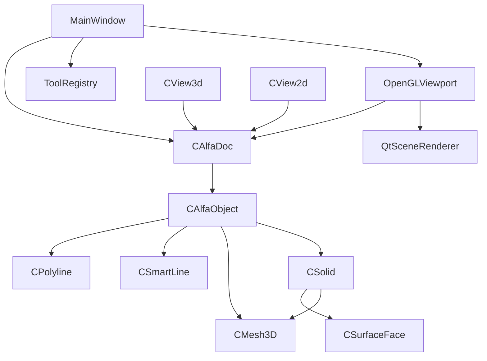

# Архитектура Dom3D Pro

Статус: `Исследуется`  
Дата фиксации: 2026-08-26  
Источник: текущие заголовки, реализации и `CMakeLists.txt`

## Назначение страницы

Это обзор фактической структуры текущего проекта. Количественные списки файлов,
классов и целей находятся в автоматически создаваемых страницах:

- [карта проекта](../generated/project-map.md);
- [индекс классов и структур](../generated/class-index.md).

В отличие от них, эта статья объясняет смысл связей и поэтому обновляется после
проверки человеком и Codex.

## Верхний уровень



Диаграмма показывает основные отношения владения и использования, а не полную
диаграмму наследования.

## Документ и объекты сцены

`MainWindow` владеет экземпляром `CAlfaDoc`. Документ хранит список объектов
сцены, материалы, идентификаторы, выделение и данные операций редактирования.

`CAlfaObject` задаёт общий интерфейс объектов: имя, идентификатор, видимость,
рендеринг, выбор, преобразования, клонирование и сериализацию. От него напрямую
или через группы наследуются основные объекты сцены.

Ключевые исходники:

- [`CAlfaDoc.h`](../../../src/CAlfaDoc.h)
- [`CAlfaObject.h`](../../../src/CAlfaObject.h)
- [`CGroup.h`](../../../src/CGroup.h)

## Геометрические представления

- `CPolyline` — полилиния и исходная геометрия кривой.
- `CSmartLine` — параметрический эскиз из связанных линий, дуг, ограничений и
  скруглений.
- `CSolid` — твёрдое тело OpenCascade и набор поверхностей.
- `CSurfaceFace` — поверхность тела, её границы, UV-представление и построение
  сетки.
- `CMesh3D` — полигональная сетка, атрибуты вершин и операции над топологией.

Ключевые исходники:

- [`CPolyline.h`](../../../src/CPolyline.h)
- [`SmartLine.h`](../../../src/SmartLine.h)
- [`solid/Solid.h`](../../../src/solid/Solid.h)
- [`solid/SurfaceFace.h`](../../../src/solid/SurfaceFace.h)
- [`CMesh3D.h`](../../../src/CMesh3D.h)

## Инструменты и интерфейс

`ToolRegistry` регистрирует команды и создаёт параметрические объекты.
`MainWindow` отвечает за панели, вкладки и координацию команд. `OpenGLViewport`
обрабатывает интерактивный выбор и передаёт документ рендереру.

В текущем коде уже присутствуют операции Architecture для стен, окон, дверей и
комнат. Однако отдельного определения класса `SmartWall` в дереве исходников на
момент генерации этой страницы нет. Предметная модель `SmartWall`, описанная
владельцем проекта, относится к следующему этапу и не должна смешиваться с
текущей реализацией инструментов через `ToolRegistry`.

Ключевые исходники:

- [`ui/MainWindow.h`](../../../src/ui/MainWindow.h)
- [`ui/OpenGLViewport.h`](../../../src/ui/OpenGLViewport.h)
- [`ui/ToolRegistry.h`](../../../src/ui/ToolRegistry.h)

## Твёрдотельное моделирование

Каталог `src/solid` содержит `CSolid`, `CSurfaceFace`, инструменты создания тел и
построители операций OpenCascade: extrusion, trim, offset, beam, polyhedron,
facade frame и поверхности по двум эскизам.

SLX и подготовка воротника для отверстий находятся в `CSurfaceFace`, а
непосредственный разрез полигональной сетки — в `CMesh3D::TrimByPline`.

Связанные статьи:

- [карта TrimByPline](../mesh/trimming/trim-by-pline.md)
- [острова как эталон SLX](../mesh-trimming-slx-islands-reference.md)

## Рендеринг

В проекте сосуществуют интерактивный Qt/OpenGL viewport, подготовка сцены и
внешние либо нативные трассировщики. Каталог `src/render` изолирует описание
сцены и интерфейсы рендереров от большей части UI.

## Импорт и экспорт

Корневые файлы `IgesIO`, `StepIO`, `ThreeDSIO`, `ObjIO`, `ExchangeIO` и
`Dom3DProjectSerializer` отвечают за внешние форматы и собственный формат
проекта. Проверки сосредоточены в `ExchangeIOTests` и `CatalogImportTests`.

## Правило актуальности

Автоматический индекс можно перестраивать после изменения исходников командой:

```powershell
cmake --build build --target CodeWiki
```

Если автоматическая карта показывает новый класс или модуль, но его назначение
ещё не проверено, сначала обновляется эта обзорная статья, а затем тематические
страницы Wiki.

