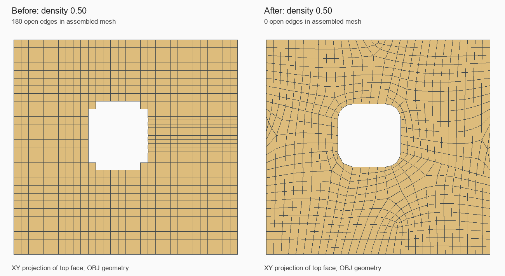

# Box_Min_Box_Filled: ступеньки у отверстия и незакрытый фронт

Статус: `Внедрено`  
Дата фиксации: 2026-09-02  
Связанные компоненты: `CSurfaceFace::UpdateMeshTypeFromBoundary`, `ContourQuadrangulator3DCoat`

## Краткий вывод

Причина ступенчатой границы — подмена двух отдельных CAD-дуг одной полной
стороной регулярной сетки. Внутренний контур переставал замыкаться и пропускался
при заполнении. После исправления обнаружился второй дефект: квадрангулятор
оставлял незаполненный шестизвенный фронт у наружной прямой границы.
Оба случая исправлены без ограничения плотности и без включения SLX.

## Условия воспроизведения

- Модель: `tests/data/mesh-regression/Box_Min_Box_Filled.dom3d`.
- Одно тело `Boolean Cut`, 14 поверхностей, сквозное скруглённое отверстие.
- `Mesh Quadro` включён, `Mesh Quadro Hole SLX` выключен, Density **0.50**.
- Ожидание: совпадающие границы плоских граней и стенок отверстия.
- До исправления: ступенчатый вырез, щели вдоль стенок; после объединения
  180 открытых рёбер, 8 граничных циклов, неманифолдная сетка.



Это проекция экспортированной геометрии, а не снимок интерфейса.

## Причина 1: полная сторона вместо фрагмента

У цилиндрической поверхности с индексом **12** (индексы здесь с нуля) шесть
CAD-рёбер, хотя геометрически это четырёхсторонний участок. Верхняя и нижняя
дуги разбиты на фрагменты. Длины их полилиний при Density 0.50:
**3.98781** и **0.48431**.

Регулярный `CNet` предоставляет четыре целые граничные строки.
`GetRegularMeshBoundaryPoints` выбирал одну такую строку для каждого
фрагмента. Синхронизация в `Solid.cpp` подставляла соседней плоской грани
дважды одну полную дугу длиной **4.43913**.

Контур из 33 точек содержал повтор дуги и оставался незамкнутым.
`BuildFilledMeshWhithHoles` пропускал этот контур, строил один патч по внешней
границе, затем проверка принадлежности OCCT-грани удаляла целые ячейки над
отверстием. Отсюда регулярная сетка с грубо вырезанной «лестницей».

### Исправление

Граница с более чем четырьмя полилиниями не переводится в `REGULAR_MESH`:
она остаётся в контурном построении, сохраняющем узлы отдельных CAD-рёбер.
Специальный путь полной сферы проверяется раньше и этим правилом не заменяется.

После этого обе плоские грани получают замкнутые внешний и внутренний
контуры и четыре островных патча. Стенки отверстия и соседние грани используют
одни и те же узлы, включая короткий фрагмент дуги.

## Причина 2: незавершённый шестизвенный фронт

При Density 0.50 один из четырёх UV-патчей имел корректную триангуляцию:
60 граничных узлов, площадь **1024.72224**. Квадрангуляция возвращала
частичный результат: 163 четырёхугольника, три пропущенных граничных узла
и внутреннюю вершину на открытой границе. Сглаживание расширяло оставшийся
незаполненный участок. После первого исправления у всего тела оставалось
18 открытых рёбер, уже у внешней границы.

Остаточный фронт: пять узлов на прямой и один внутри. Обычное продвижение
и перебор классификаций углов не находили допустимого шага.

### Исправление

Только после исчерпания обычных шагов `closeSixNodeFront` проверяет три
противоположные диагонали шестизвенного кольца. Принимается разбиение на два
выпуклых четырёхугольника с положительной площадью; коллинеарные соседние
стороны разрешены, отрицательные повороты и нулевая площадь отклоняются.
Новые вершины не добавляются, граничные узлы не удаляются. Затем продолжается
обычная обработка оставшихся фронтов и сглаживание.

Это не замена успешных шагов квадрангулятора и не переход на треугольники.

## Проверка

`BoxMinBoxFilledQuadro` перестраивает одно и то же тело на Density
**0.20, 0.25, 0.35, 0.50, 0.65, 0.80, 1.00 и повторно 0.50**.
Проверяются только четырёхугольники, ненулевая площадь, конечные координаты,
связность каждой поверхности, два граничных цикла каждой плоской грани,
четыре островных контура, сохранение короткой дуги, отсутствие диагностик
аварийного перехода и замкнутая манифолдная сетка после сварки.

На Density 0.50: **1920 вершин, 0 открытых рёбер** вместо исходных 180.
Все восемь перестроений теста заняли около 8 секунд на рабочей машине.
Снятые ранее ограничения плотности не возвращались.

```powershell
ctest --test-dir build -C Release -R BoxMinBoxFilledQuadro --output-on-failure
```

Также прошли прежние `ToolsMesh3DFillContour`, `ExtrudeSlQuadro`,
`SurfacePatchWelding`, `BezierCollarWelding`, `SmallHoleSlxCollar`,
`HoleLowDensityCollar`, `FusionCylinderFrontGuard`, `CylinderSeamTrimDirection`,
`MeshRegressionCorpus`. Последний учитывает известный отдельный дефект
`Boolean_Fill`; его прохождение не означает исправление той модели.

## Связанные материалы

- [Исходная классификация поверхности](../../../src/solid/SurfaceFace.cpp)
- [Квадрангулятор](../../../src/ContourQuadrangulator3DCoat.cpp)
- [Регрессионный тест](../../../tests/CatalogImportTests.cpp)
- [Диагностическая модель и контрольная сумма](../../../tests/data/mesh-regression/README.md)
- [Extrude_SL: вырожденная полоса в UV](extrude-sl-degenerate-front.md)
- [SLX: угловой воротник](trimming/slx-angular-collar.md) — похожий внешний
  симптом, но другой алгоритм и другая причина; в данном тесте SLX выключен.

## История

- 2026-09-02 — воспроизведены обе причины, добавлены исправления, тест и сравнение OBJ.
