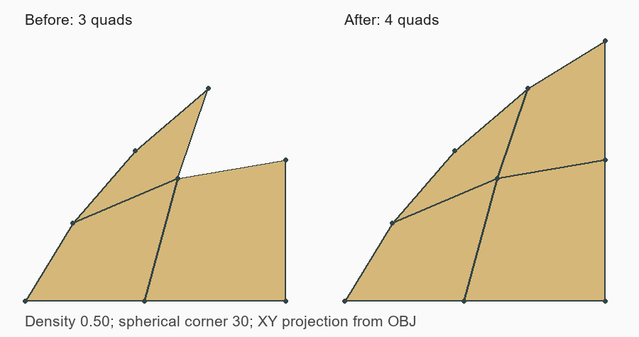

# ChamferAndFillets: удаление ячейки у полюса скругления

Статус: `Внедрено`  
Дата фиксации: 2026-09-02  
Связанный компонент: `CSurfaceFace::MakeFilledContour`

## Краткий вывод

Угловая Quadro-сетка строилась правильно, но одна ячейка ошибочно удалялась
последующей UV-классификацией. При обратном переводе полярной проекции в UV
угол сферического полюса вычислялся через `atan2` от почти нулевых координат.
Получался произвольный U. Кроме того, `atan2` возвращал углы в другом периоде,
чем исходный CAD-контур. Усреднение таких UV давало центр ячейки вне грани.

## Условия воспроизведения

- `tests/data/mesh-regression/ChamferAndFillets.dom3d`: тело `Solid Box`, 42 грани.
- `Mesh Quadro` включён; `Mesh Quadro Hole SLX` выключен.
- Density 0.50; дефект также наблюдался пользователем на других плотностях.
- До исправления у верхних сферических углов с индексами 30, 40, 41 (с нуля)
  оставалось по три ячейки вместо четырёх. У аналогичной грани 26 было четыре.
- После сварки: 12 открытых рёбер, три отверстия.



Изображение построено из OBJ, это XY-проекция одного сферического участка,
а не снимок интерфейса. Справа сохранена ранее удалявшаяся угловая ячейка.

## Диагностика

Клетка у полюса уже существовала до `delete_mesh_faces_outside_occt_face`.
Например, на грани 40 диапазон U — `[0, 0.955317]`. У трёх неполярных
вершин проблемной ячейки U были примерно `0.955316`, `0.000001`, `0.321472`,
а у полюса — **-1.62514**. Средний U после периодического переноса становился
**6.1961**, то есть вне нужного сектора. Классификатор закономерно удалял
ячейку, но причина была в неверной параметризации её вершин.

На грани 30 CAD использует U в `[5.32787, 6.28319]`, а `atan2` возвращал
эквивалентные отрицательные углы. Угол самого полюса был **1.91325**.
Перенос только среднего значения на период не исправляет такое смешение.

## Исправление

В обратном переводе полярной проекции:

1. Выбирается опорный U посередине диапазона неполярных узлов входного контура.
2. При радиусе проекции не больше `4 * epsilon(float) * radius` полюсу
   назначается этот U, вместо вычисления `atan2` от численного шума.
3. U каждой вершины переносится на ближайший к опорному значению период,
   до вычисления центров и классификации ячеек.

XYZ полюса от выбора U не зависит. Геометрическая проверка не отключается,
плотность не ограничивается, квадрангулятор и режим SLX не заменяются.
Изменение действует только в уже существующей ветке полярной проекции сферы.

## Проверка

На Density 0.50 все четыре верхних угла содержат по четыре четырёхугольника.
После сварки: **0 открытых рёбер**, манифолдная замкнутая сетка, 3218 вершин.

`ChamferAndFilletsQuadro` перестраивает то же тело на Density
**0.20, 0.35, 0.50, 0.65, 0.80, 1.00 и повторно 0.50**.
Проверяет связность поверхностей, Quadro-ячейки, отсутствие вырожденных рёбер
и нулевой площади в четырёх исправленных углах, отсутствие аварийного перехода,
сохранение четырёх ячеек при 0.50 и замкнутость сваренного тела.

```powershell
ctest --test-dir build -C Release -R ChamferAndFilletsQuadro --output-on-failure
```

Исходная модель не изменена. Нижние регулярные сферические участки с
вырожденной параметрической строкой — отдельный существующий путь; это
исправление не меняет их топологию.

## Связанные материалы

- [Код преобразования и классификатор](../../../src/solid/SurfaceFace.cpp)
- [Тест](../../../tests/CatalogImportTests.cpp)
- [Модель и SHA256](../../../tests/data/mesh-regression/README.md)
- [Box_Min_Box_Filled](box-min-box-filled-boundary.md) — другие причины разрыва.
- [Extrude_SL](extrude-sl-degenerate-front.md) — вырожденный фронт, не ошибка угла полюса.

## История

- 2026-09-02 — локализовано удаление корректной ячейки, исправлены угол полюса
  и период U; добавлен регрессионный тест.
