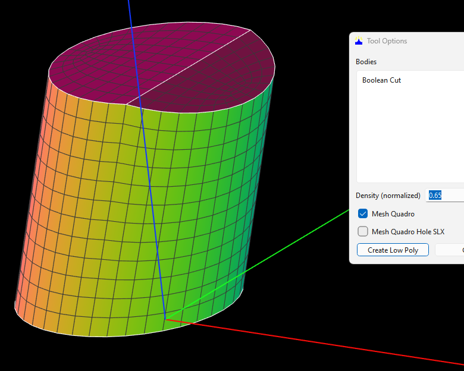
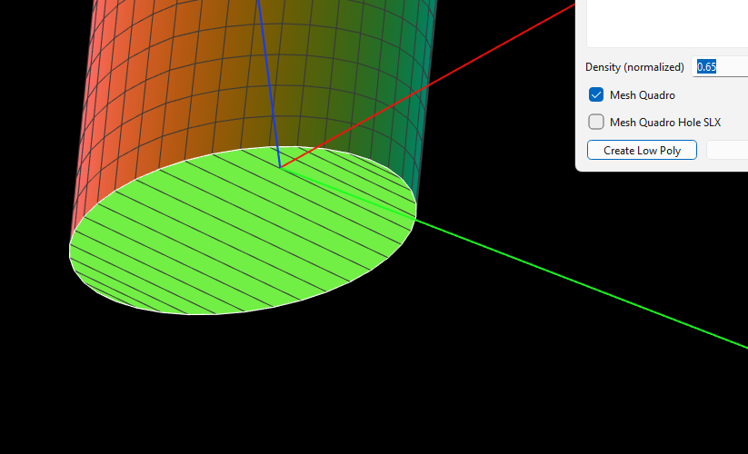

# CapRetopo для круглой и эллиптической плоской границы

Статус: `Внедрено`  
Дата фиксации: 2026-09-01  
Компоненты: `sync_circular_caps_from_curved_mesh`,
`CSurfaceFace::BuildFilledMeshWhithHoles`

## Краткий вывод

Плоскую торцевую грань с одной замкнутой круглой или эллиптической границей
нужно строить специальным методом `CapRetopo::DoCap2`, а не общим заполнением
длинными полосами. Внешнее кольцо `Cap` должно точно совпадать с фактическим
кольцом уже построенной цилиндрической поверхности.

## Исходный диагностический случай

На втором изображении плоская крышка заполнена длинными поперечными полосами.
Причина состояла не в `Density`: наклонное сечение цилиндра образует на
плоскости математический эллипс, а прежняя ветка `Cap` принимала только
`GeomAbs_Circle`.

## Алгоритм Cap

1. На уже построенной сферической или цилиндрической поверхности находится
   фактическая замкнутая граничная петля.
2. Петля передаётся смежной плоской грани как
   `m_CircularCapMasterBoundary3D`. Поэтому обе поверхности используют те же
   узлы и одинаковую угловую фазу.
3. Внутри плоской грани строятся концентрические кольца. Число колец
   вычисляется по отношению радиуса к медианному шагу внешней границы и
   ограничивается диапазоном `1..10`, соответствующим `DoCap2::QtyDiv`.
4. Соседние кольца соединяются квадрами. Последнее кольцо закрывается парами
   граничных узлов и центральной вершиной.

Для окружности внутренние кольца получают равномерную угловую фазу. Для
эллипса они являются масштабированными относительно центра копиями точного
внешнего кольца. Так сохраняется форма наклонного сечения и не появляются
длинные полосы.

## Условия применения

- поверхность плоская;
- имеется один топологический контур;
- все невырожденные рёбра контура являются окружностями или эллипсами;
- внешняя граница замкнута и содержит не менее шести узлов.

Если плоский торец Boolean-операции разделён на несколько самостоятельных
BRep-граней, он не является одним `Cap`: каждая грань сохраняет собственную
топологию. Объединение такого торца требует отдельного безопасного слияния
копланарных граней.

## Проверенный результат

Для `Cylinder_Trimed_By_Plane.dom3d` при `Density = 0.65` нижняя эллиптическая
крышка после выбора `Cap` имеет 229 вершин и 209 квадов вместо 38 вершин и 18
длинных квадов. Для всего тела диагностируется:

- `occtOutside = 0`;
- `boundaryEdges = 0`;
- `boundaryLoops = 0`;
- `manifold = 1`.

Связанный код:

- [`src/solid/Solid.cpp`](../../../src/solid/Solid.cpp) — передача точного
  граничного кольца от криволинейной поверхности;
- [`src/solid/SurfaceFace.cpp`](../../../src/solid/SurfaceFace.cpp) — построение
  концентрических колец и центрального участка `Cap`.

## История

- 2026-09-01 — `CapRetopo` распространён с окружности на эллиптическую границу;
  добавлен диагностический случай наклонно обрезанного цилиндра.

