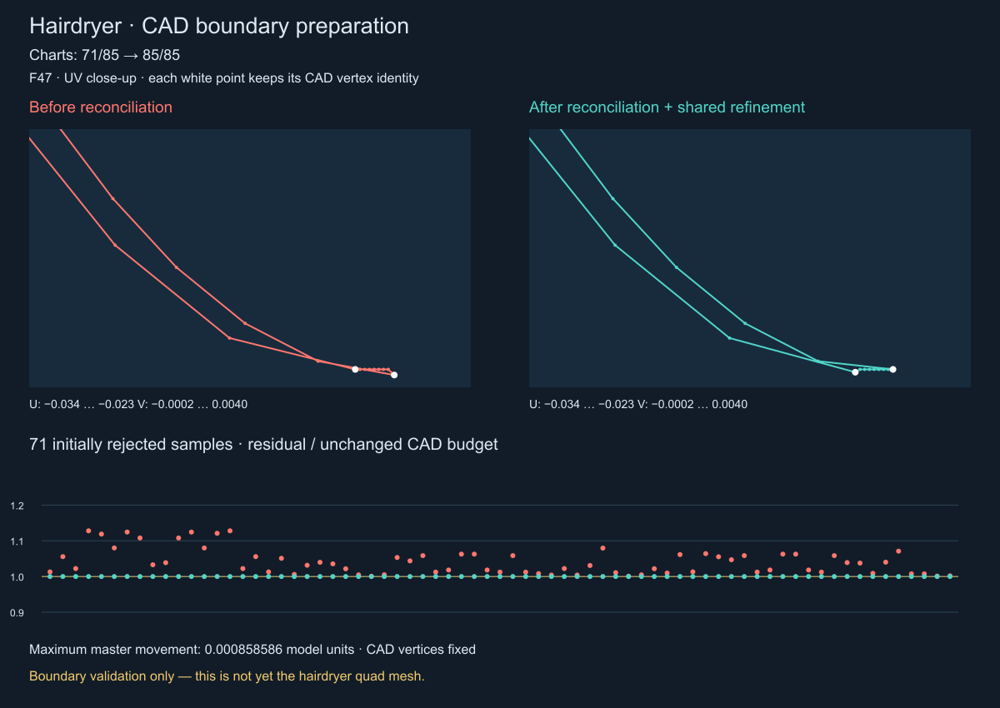

# Фен: согласованные CAD-границы перед заполнением сеткой

Продолжение: [первый потребитель charts и проверка клеток](hairdryer-cad-chart-consumer.md).

Реализован следующий этап подготовки boundary. Основная оболочка `Imported STEP 4`
проходит подготовку всех **85 граней**, вторая оболочка `Imported STEP 13` — всех
**283 граней**. Это готовые дискретные UV-области, **не готовая квадро-сетка фена**.
Новый режим включается явно в API подготовки; пользовательский Mesh Quadro для
фена пока использует прежний mesher. Quadrangulator на этом этапе не изменён.

## Что обнаружено

В строгом режиме master лежит точно на пространственной CAD-кривой. На основной
оболочке 59 внутренних узлов немного выходили за бюджет соответствия pcurve.
Это не разрыв CAD wire: вхождения рёбер имеют правильные общие идентификаторы,
но их геометрические представления приблизительны.

У F47 дополнительно пересекалась дискретная UV-граница. Было две причины:

1. Концы двух pcurves одного CAD-угла различаются в пределах допуска вершины.
   Использование только начала следующего occurrence срезало узкий участок.
2. При уменьшении chordTolerance до 0.005 одна из близких кривых уточнялась,
   а другая оставалась грубой. Их хорды пересекались. Аналогичный случай проявился
   на F58. Увеличение общего допуска не устраняет эту ошибку дискретизации.

## Реализация

### Общий пространственный представитель

`SamplingOptions::allowCadToleranceReconciliation` по умолчанию выключен.
При включении каждый проблемный внутренний master node получает кандидата внутри
пересечения следующих замкнутых шаров:

- центр на исходной 3D CAD-кривой, радиус — исходный edge tolerance плюс прежний
  численный запас;
- центры на поверхностях в сохранённых UV-параметрах всех occurrences общего
  ребра, радиусы — их прежние CAD-бюджеты.

Концы рёбер остаются исходными CAD-вершинами. Пространственные CAD-кривые,
поверхности, pcurves, UV samples и допуски не редактируются. Изменяется только
дискретный представитель **до публикации** нового immutable snapshot.
После публикации master по-прежнему един для всех соседних faces и неизменяем.

Используются циклические проекции с детерминированной сортировкой ограничений и
ограничением 128 итераций. Это поиск допустимой точки, не оптимизация качества
и не доказательство ближайшего решения. Кандидат публикуется только после
проверки всех исходных бюджетов. Малый внутренний отступ при проекции предотвращает
округление наружу; радиус допуска не увеличивается. Неудачная попытка сохраняет
исходный узел и явную ошибку. Повторно проверяются длины сегментов и измеренная
по пробам ошибка хорды относительно исходной CAD-кривой.

### Углы UV-области

Для двух вхождений одного CAD-угла сначала рассматривается симметричная середина
UV-концов после периодического согласования. Кандидат должен укладываться в оба
исходных бюджета. Если полигон пересекается, ограниченно проверяются исходные
UV-концы этих же вхождений; принимается только вариант, уменьшающий число
пересечений всего контура. Исходные pcurves остаются доступны без изменений;
`cornerReconciled` обозначает изменённое UV-положение экземпляра угла в chart.
Узел сохраняет тот же CAD NodeId и XYZ. Никакие точки рёбер не удаляются.

Поиск ограничен 128 кандидатами и 8 миллионами проверок пар сегментов на loop.
Неустранимое пересечение остаётся отказом; настоящую самопересекающуюся CAD-область
этот механизм не объявляет исправленной.

### Обратная связь дискретизации

`maximumChartRefinementPasses` по умолчанию равен 0. При ненулевом значении
UV-адаптер возвращает occurrences пересекающихся сегментов. Через их EdgeId
увеличиваются числа сегментов **общих CAD master-рёбер**, после чего заново
подготавливаются все их вхождения. Сохраняются ограничения равенства количества
сегментов; face-local вставка точек запрещена. CAD topology повторно не копируется.

При chordTolerance 0.005 потребовался один проход:

| EdgeId | Сегменты | Соседние faces |
|---|---:|---|
| 131 | 16 → 32 | 44, 47 |
| 139 | 8 → 16 | 47, 55 |
| 181 | 16 → 32 | 58, 69 |
| 183 | 8 → 16 | 58, 70 |

События сохраняются в `chartRefinements`. Лимиты проходов и сегментов завершаются
явной ошибкой `ChartRefinementBudgetExceeded`. Эти проходы относятся к подготовке
границ, а не к итерациям квадрангулятора.

## Проверка

Fixture `tests/data/mesh-regression/Hairdryer.dom3d` совпадает с пользовательским
`Фен.dom3d`, SHA256:
`9CFC6ABAA75E5415184D17C282FE8F6FDB9DF97B933B1289F4763ECABA79A61B`.

| Оболочка | Chord tolerance / max segment length | Готовые charts | Смещённые внутренние узлы |
|---|---|---:|---:|
| Imported STEP 4 | 0.01 / 5 | 85/85 | 59 |
| Imported STEP 4 | 0.005 / 2.5 | 85/85 | 71 |
| Imported STEP 13 | 0.01 / 5 | 283/283 | 85 |

Для основной оболочки максимальное смещение master — 0.000858585547 единицы
модели. CAD-вершины неподвижны; бюджеты и raw pcurve samples не меняются.
Snapshot создаётся один раз при смене параметров подготовки. Проверяется настоящее
отверстие F15: внешняя область принимается, точка внутри отверстия исключается.



На рисунке более мелкая дискретизация. Для сравнения строгий контроль построен
с теми же окончательными числами сегментов, что и согласованный snapshot;
поэтому его 71/85 отличается от исходных 73/85 на более грубом шаге.
График показывает residual / CAD budget, а не историю сходимости solver.
На проверенных реальных узлах пространственная коррекция потребовала один проход.

`HairdryerCadBoundary` проверяет обе оболочки, две дискретизации основной,
CAD identity, неизменность бюджетов и raw UV, замыкание wires, геометрическую
принадлежность углов, сохранение отверстия и кэш. `QuadroBoundarySnapshot`
дополнительно проверяет допустимые и несовместимые tolerance envelopes, неподвижные
CAD-вершины, отсутствие публикации неудачного кандидата и ограниченный отказ
при настоящем самопересечении. Выбранные CTest: **6/6 passed**, включая Подушку-2,
кэш тела, ToolsMesh3DFillContour и ExtrudeSlQuadro. Сборка Release приложения успешна.
Повторный OBJ Подушки-2 побайтно совпадает с результатом предыдущего этапа:
SHA256 `82D602865C45D207845BBFDB3162AE609F73C7F32B5B6B6B91D3ECD34F46E6D1`.

## Воспроизведение и следующий этап

```cpp
quadro::SamplingOptions options;
options.allowCadToleranceReconciliation = true;
options.maximumChartRefinementPasses = 8;
auto boundary = solid.PrepareQuadroBoundary(options);
auto chart = quadro::BuildFaceBoundaryInput(boundary, faceId);
```

```powershell
CatalogImportTests.exe --snapshot-project-boundary tests/data/mesh-regression/Hairdryer.dom3d 'Imported STEP 4' output/hairdryer-boundary-reconcile/hairdryer.json --cad-tolerance
ctest --test-dir build -C Release -R 'HairdryerCadBoundary|QuadroBoundarySnapshot|PillowCadQuadro' --output-on-failure
```

Без `--cad-tolerance` сохраняется прежний строгий диагностический режим. Переменная
`DOM3D_BOUNDARY_TEST_REPORT` задаёт префикс парных JSON-отчётов теста.
`tools/Visualize-QuadroBoundary.py` строит SVG-сравнение этих пар.

Следующий этап — потребитель подготовленных многосвязных областей: декомпозиция
в patches, сохранение seam instances и общих границ при заполнении отверстий,
проверка покрытия и качества клеток. Текущая успешная проверка boundary не
сертифицирует всю непрерывную CAD-геометрию, произвольную плотность, float-конверсию
будущей сетки или готовность старого quadrangulator принять эти контуры.
Рабочий путь Подушки-2 использует прежние настройки и этим этапом не переключается.
