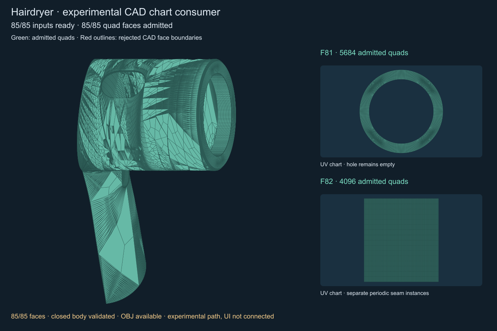
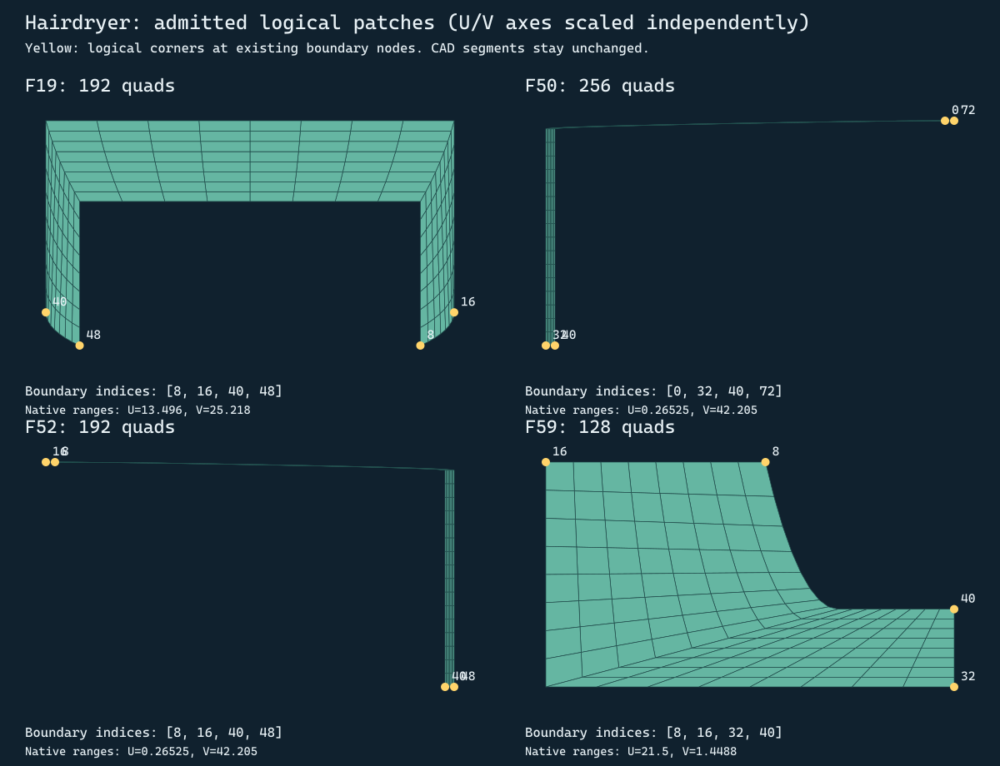

# Фен: первый потребитель CAD charts и проверка квадро-клеток

Реализован экспериментальный `quadro::FillCadChart`. Он получает готовый
`FaceBoundaryInput` и строит клетки без изменения исходного тела. Для основной
оболочки фена получены **85/85 допустимых входных UV-сеток** и **71/85 граней,
прошедших проверку квадро-клеток**. Полная квадро-сетка фена пока не готова.
Обычный Mesh Quadro для фена на этот потребитель не переключён.



Зелёным показаны принятые клетки. Красным — только CAD-границы отклонённых граней;
их внутренняя область на сборной картинке не заполнена. Это диагностическая
композиция, не замкнутая сетка тела. Число принятых граней не означает такую же
долю готовности: среди оставшихся есть большие наружные поверхности.

## Реализованный путь

1. Четырёхсторонняя CAD-грань с совместимыми количествами сегментов получает
   структурированный патч Coons с общими master nodes. Это тот же тип заполнения,
   который используется для Подушки-2. В этом режиме приняты 46 граней фена.
2. Для остальных областей строится промежуточная триангуляция **в UV**, учитывающая
   исходный outer и holes. Используется vendored earcut с ISC-лицензией.
   Координаты кондиционируются, коллинеарные точки временно исключаются только
   из индексов triangulator, затем восстанавливаются по порядку исходного wire.
   Ни один CAD boundary segment не может исчезнуть. UV-триангуляция служит входом
   построителя, а не обещанием точной пространственной аппроксимации поверхности.
3. Область с отверстиями разбивается существующим `SurfacePatchBuilder` на простые
   патчи. Внутренний разрез получает общие узлы, определённые парой исходных
   UV-экземпляров CAD-узлов, количеством интервалов и номером интервала. Обратный
   обход использует тот же канонический представитель. Слияние разных CAD-узлов
   по близости XYZ не применяется. После сборки исходные hole boundaries проверяются
   снова, поэтому потерянное отверстие или разомкнутый разрез не принимаются.
4. Неизменённый `Build3DCoatQuadrangulation` вызывается в существующих режимах Dom3D
   и reference. Проверяются варианты с локальным масштабом параметрических
   направлений поверхности и в исходных UV-пропорциях. Масштаб оценивается конечными
   разностями; это приближение метрики, не оптимизированное поле направлений.
5. Принимается только кандидат, прошедший проверку контракта. Отказ не заменяется
   треугольной сеткой и не публикует частичную геометрию в CSolid.

Код основного квадрангулятора этим этапом не изменён. Режим Dom3D означает вызов
публичного API с `exact_reference=false`, а не обещание того, какой внутренний
кандидат выбрал существующий API.

## Логические стороны патча — 2026-09-05

После отказа существующих способов добавлен ограниченный поиск четырёх логических
углов на неизменённом односвязном контуре. Для чётного числа сегментов N углы
выбираются как a, b, a+N/2, b+N/2. Поэтому противоположные составные стороны имеют
одинаковое число сегментов. CAD-вершины, occurrences, UV и master nodes не меняются;
логический угол не создаёт новую топологическую CAD-вершину.

Кандидаты упорядочены по сумме поворотов контура в выбранных углах. Проверяются
не более 256 вариантов для контуров от 8 до 1024 узлов, каждый проходит обычный
контроль Coons. Это ограниченная эвристика, а не доказательство невозможности
построения при отказе. Уже успешные пути имеют приоритет.

Дополнительно приняты F19 (192 клетки), F50 (256), F52 (192), F59 (128): всего
768 новых клеток. В отчёте `logicalCorners` содержит индексы исходного контура;
`attempts` — номер принятого кандидата или количества отказов по причинам.



На этой UV-диаграмме оси масштабированы независимо: исходные диапазоны подписаны.
Изображение показывает структуру клеток, не их пространственные пропорции.
F66/F67 пока не проходят: среди 256 вариантов у F66 — 217 отказов UV и 39
пространственных перегибов, у F67 — 255 и 1 соответственно. Простого переноса
логических углов здесь оказалось недостаточно.

## Контракт результата

- Все клетки — четырёхугольники с корректными индексами и конечными координатами.
- Внутренние рёбра имеют два противоположных вхождения.
- Открытые рёбра результата в точности воспроизводят исходные граничные сегменты
  и ориентированные CAD NodeId. Seam instances сохраняются раздельно в UV,
  даже если ссылаются на один пространственный master node.
- Граничные XYZ восстанавливаются из master без независимой проекции и без
  координатной сварки. Новые или перемещённые фронтом граничные узлы отвергаются.
- Проверяются выпуклость/ориентация UV-клеток, положение центров относительно
  outer/holes, суммарная площадь покрытия и отсутствие пространственного перегиба
  двух треугольников клетки. Внутренние XYZ вычисляются на исходной CAD-поверхности.

Это проверки дискретной области и ориентации. Они не заменяют оценку отношения
сторон, равномерности, пространственной ошибки хорды, качества сглаживания,
полного пересечения клеток в 3D и проверки float-геометрии перед публикацией.
В частности, зелёный цвет означает прохождение перечисленных проверок, а не
достижение окончательного качества сетки.

## Результаты реального файла

Fixture: `tests/data/mesh-regression/Hairdryer.dom3d`, тело `Imported STEP 4`.
Настройки подготовки: chordTolerance=0.01, maxSegmentLength=5,
CAD tolerance reconciliation включён, максимум 8 уточнений chart.
Эти параметры не выдаются за пользовательскую Density 0.50.

| Результат | Количество |
|---|---:|
| Допустимые входные UV-сетки | 85/85 |
| Структурированные CAD-патчи Coons | 46 |
| Дополнительно принятые грани после фронта/разрезов | 21 |
| Дополнительно принятые логические Coons-патчи | 4 |
| Всего принятых граней | 71/85 |
| Клетки на принятых гранях | 23613 |
| F81: кольцевая область с отверстием | 4 патча, 768 четырёхугольников |
| F82 и F83: периодические charts | по 1024 четырёхугольника |

У F81 внутренняя область кольца остаётся пустой. У F82/F83 проверено сохранение
раздельных UV-сторон периодического шва. Прямое заполнение многосвязного контура
старым фронтом не дало результата; F81 построена после разбиения на простые патчи.

### Оставшиеся отказы

| Грани | Основной зарегистрированный отказ |
|---|---|
| 15 | В патче 0 после разрезания фронт меняет граничный узел |
| 28 | В патче 1 после разрезания получена невыпуклая/перевёрнутая UV-клетка |
| 47, 58 | Выходная сегментация границ не совпадает с CAD-контрактом |
| 48, 49, 67 | Фронт перемещает или добавляет граничный узел |
| 20, 43, 56, 63, 66, 76, 84 | Невыпуклая или перевёрнутая UV-клетка |

Это причины основного отвергнутого кандидата; альтернативные проходы могут иметь
другой отказ. Все результаты попыток записаны в отчёте. Для F66/F67 также
зафиксирован отказ прямого Coons: несовместимые количества сегментов противоположных
сторон. После исправления boundary остаётся конкретная задача согласования
составных сторон и поведения фронта, а не прежнее угадывание wire по XYZ.

## Диагностика и регрессии

`ChartFillResult` сохраняет исходный UV-донор, его треугольники, master IDs,
принятые клетки/XYZ, режим построения и причины попыток. Для разрезания сохраняются
точные контуры пройденных патчей до отказа, номер проблемного патча и его кандидат,
если фронт успел создать клетки. `candidateUV/candidateCells` относятся к основному
проходу; альтернативы имеют текстовые результаты. Полная история итераций
внутреннего фронта здесь не инструментирована.

```powershell
CatalogImportTests.exe --diagnose-hairdryer-chart-fill tests/data/mesh-regression/Hairdryer.dom3d output/hairdryer-chart-fill
ctest --test-dir build -C Release -R HairdryerCadChartConsumer --output-on-failure
python tools/Visualize-QuadroChartFill.py output/hairdryer-chart-fill/report.json output/hairdryer-chart-fill/overview.svg
```

`HairdryerCadChartConsumer` независимо сравнивает ориентированные CAD-рёбра и
точные master XYZ всех принятых граней; требует 85 корректных входов и фиксирует
14 известных отказов как характеристическую регрессию. Изменение профиля требует
просмотра нового результата перед обновлением ожиданий. Прохождение этого теста
**не означает**, что все 85 граней построены в квадро.

Выбранные CTest прошли: **7/7**, включая новую проверку, HairdryerCadBoundary,
QuadroBoundarySnapshot, кэш тела, Подушку-2, ToolsMesh3DFillContour и ExtrudeSlQuadro.
Release-сборки CatalogImportTests и Dom3D_Pro успешны. Производственный путь
Подушки-2 не переключён и проходит прежнюю регрессию.

## Следующий этап

Согласовать числа сегментов для F66/F67 и спланировать дополнительные патчи
для больших областей F15/F28 и тонких полос F47/F58. Для случаев, где фронт
всё ещё меняет границу или создаёт невыпуклые клетки, потребуется отдельное
исправление генерации кандидатов либо другой локальный способ заполнения.
Подключать новый путь к обычному Mesh Quadro следует после успешной проверки
всего тела, его замкнутости и геометрии, сохраняемой для отображения.
