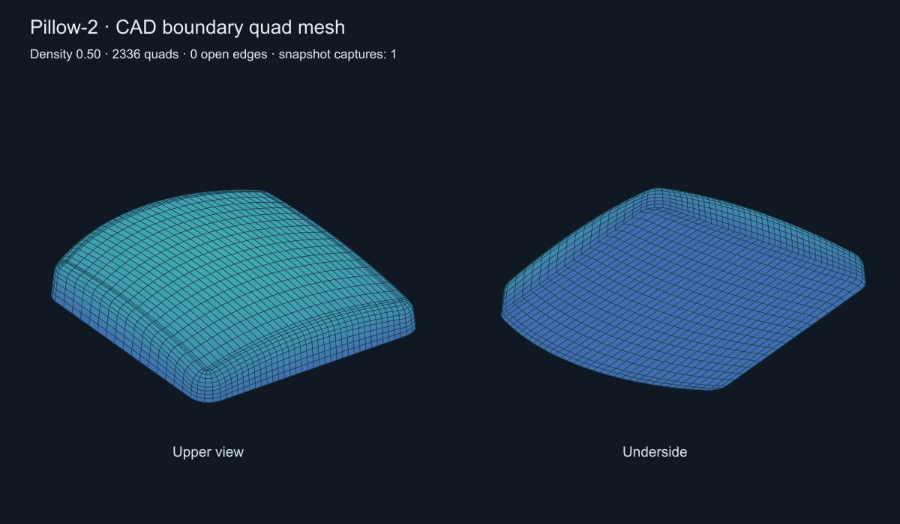

# Подушка-2: построение квадро по общим CAD-границам

Реализован первый потребитель новой boundary-архитектуры: обычный **Mesh Quadro**
строит все 18 граней `Extrude Solid` в `Подушка-2` согласованными четырёхугольными
патчами. Флаг Mesh Quadro Hole SLX для этой ветки должен быть выключен.
Исходный quadrangulator не изменён в рамках этого этапа.

## Технология

`CSolid::BuildQuadroMesh` вызывает `BuildStructuredCadBody`. Планировщик проверяет
CAD-топологию: замкнутое тело, две разные соседние грани на каждом ребре,
один wire на грань, четырёх- или восьмирёберные грани, отсутствие seams и
вырожденных рёбер. Для текущего этапа требуется хотя бы одна восьмирёберная
грань с чередованием длинных сторон и коротких скруглений. Имя файла не используется.

План задаёт совместные ограничения на число сегментов противоположных сторон.
Восьмирёберная крышка получает четыре логические стороны; углы сетки находятся
в серединах четырёх коротких рёбер. CAD-рёбра при этом не разрезаются и не сливаются.
Обе соседние грани используют одну master-дискретизацию каждого ребра и свои pcurves.

Внутри UV-контура строится сетка Coons. Внутренние узлы вычисляются на CAD-поверхности;
граничные XYZ берутся из master nodes без независимого перепроецирования.
Проверяются UV-складки, выход центров клеток за контур, полнота площади покрытия,
вырожденность пространственных клеток и потеря точности при записи float.
До публикации проверяется замкнутость всего тела по master ID: у каждого ребра
две клетки с противоположными направлениями. Координатная сварка не используется
для исправления разрывов на этом этапе. Все патчи подготавливаются до обновления
отображаемых сеток. Ошибка подходящего патча возвращается явно, без скрытого fallback.

При испытании выявлена дополнительная ошибка snapshot: `BRepBuilderAPI_Copy::ModifiedShape`
не гарантирует ориентацию исходного вхождения грани. Теперь перед сохранением
признака reversed явно восстанавливается `input[fi].Orientation()`. Иначе замкнутая
сетка подушки имела нормали внутрь и отрицательный объём. Проверка прямого и
обратного вхождений каждой грани добавлена в QuadroBoundarySnapshot.

## Проверка реального проекта

Fixture: `tests/data/mesh-regression/Podushka-2.dom3d`.
SHA256: `68A39E6AB57F69997B64F2E781B7A9168431292B6295D4DEEAC130B91A6258EF`.

Дополнительно проверена актуальная копия пользовательского проекта от 05.09.2026
11:35:57, SHA256 `DD5053762B2A4E3FD3BEB94788D803DA12BDAEEDCD31BF2A20E71F5C2C0B879D`.
Она проходит те же проверки на всех трёх плотностях и сохранение/повторное открытие;
результат находится в `output/pillow-cad-mesh/pillow-current-quadro.dom3d`.

| Density | Четырёхугольники | Вершины после сборки | Открытые рёбра | Ошибка объёма |
|---|---:|---:|---:|---:|
| 0.25 | 1440 | 1442 | 0 | 0.2075% |
| 0.50 | 2336 | 2338 | 0 | 0.1470% |
| 1.00 | 3744 | 3746 | 0 | 0.1138% |

Во всех случаях 18 непустых граней, только четырёхугольники, согласованная
ориентация, характеристика Эйлера 2, центры клеток внутри CAD-граней.
Последовательность 0.25 → 0.50 → 1.00 → 0.50 сохраняет один topology snapshot;
повторная 0.50 даёт точно те же вершины и индексы. Плотность меняет дискретизацию,
а не CAD snapshot. Изменение тела требует новой версии snapshot согласно
[правилам кэша](quadro-boundary-cache-and-charts.md).

`PillowCadQuadro` выполняет эту проверку. Дополнительный аргумент команды
`CatalogImportTests --test-pillow-cad-quadro <fixture> <output-prefix>` сохраняет OBJ
и DOM3D и проверяет точное восстановление вершин/индексов из DOM3D.
Сохранённые результаты и журналы: `output/pillow-cad-mesh/`.

Из 11 выбранных регрессий проходят 10. `SpherePoleQuadro` сообщает
`Sphere and Cap use different boundary node counts`; тот же сбой воспроизведён
в контрольной сборке с полностью отключённым вызовом новой ветки построения.
Это отдельный существующий дефект, не исправленный этим этапом.

## Границы применимости

Это рабочий путь для согласованных округлых патчей, а не универсальный mesher
произвольных trimmed surfaces. Отверстия, периодические seams, полюса и общие
многогранные контуры сохраняют прежнюю ветку. Фен этим этапом не исправлен:
ему ещё нужны обработка отклонений pcurve, chart cuts и разбиение многосвязных
областей. Сильно искривлённый UV-патч может быть отвергнут проверкой Coons;
следующий общий этап — планирование нескольких патчей и внутренняя релаксация
при неподвижных общих CAD-границах.
