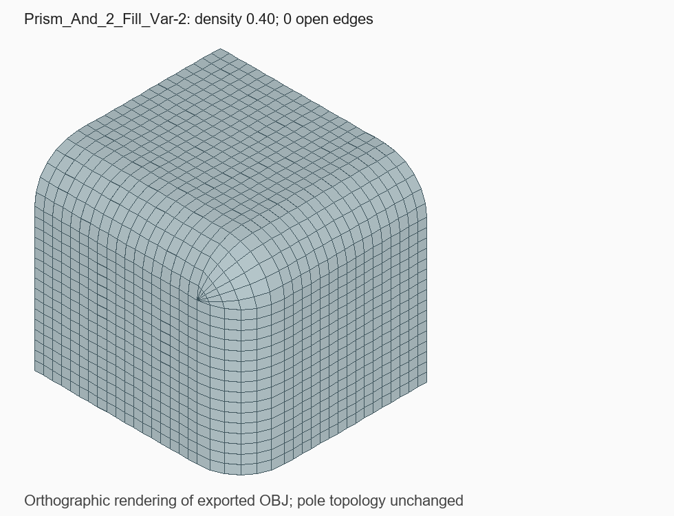

# Prism_And_2_Fill_Var-2: отказ нормали на схлопнутой стороне

Статус: `Внедрено`  
Дата фиксации: 2026-09-02  
Связанные компоненты: `CSurfaceFace::GetPoint`, `normal_from_near_points`, `CNet`

## Краткий вывод

Quadro не завершалось из-за одной пустой грани, а не из-за всей формы призмы.
Угловая B-Spline-поверхность имеет три реальные границы и четвёртую сторону,
схлопнутую в точку. Координаты этой точки вычислялись, но расчёт нормали
возвращал отказ и `CNet` очищал сетку. Восстановление нормали по соседним
аналитическим производным устраняет отказ, не перемещая точку поверхности.

## Условия воспроизведения

- Файл `Prism_And_2_Fill_Var-2.dom3d`, тело **Prism**, 10 поверхностей.
- В документе есть ещё четыре тела `Solid Box`; они не являются объектом
  данного дефекта.
- Density **0.40**, `Mesh Quadro` включён, SLX выключен.
- До исправления: `ReBuldMesh=false`, поверхность **5** пустая (индексы с нуля),
  диагностический адаптивный `CNet::Build` возвращает 3 — отказ точки/нормали.
- Остальные девять поверхностей уже получали Quadro; вокруг отсутствующего
  угла оставалось 18 открытых рёбер.

## Причина

На вырожденной параметрической стороне одна производная обращается в ноль.
Прямое векторное произведение производных и `GeomLProp_SLProps` не дают
нормали. Старый запасной путь брал хорды к соседним точкам с шагом порядка
`1e-5` от диапазона параметра. Около схлопнутой стороны эти хорды почти
параллельны, а квадрат их векторного произведения ниже абсолютного порога
`1e-20`. Геометрия точки корректна, но функция возвращает `false`.

## Исправление

Только если старый запасной расчёт не нашёл нормаль, проверяются производные
`D1` в тех же соседних UV-точках, ограниченных диапазоном поверхности.
Нормализованное `dU × dV` задаёт ориентацию параметризации. В итоговый
`CPoint8d` возвращается **исходная точка**, а не точка пробного смещения.
Расположение и ориентация грани применяются прежним кодом `GetPoint`.

Не меняются успешные прежние расчёты, плотность, контуры, SLX и алгоритм
квадрангуляции. Забракованное деление угла на три блока не возвращалось.

## Результат и границы исправления

При Density 0.40 поверхность 5 получает сетку 7 × 7 узлов / 36 ячеек.
Тело перестраивается успешно; после сварки — 2518 вершин,
**0 открытых рёбер**, замкнутая манифолдная сетка.



Изображение построено из экспортированного OBJ. В углу видна сохранённая
полярная структура сетки; это не подмена невырожденной all-quad топологией.

Это исправление отказа вычисления нормали. Регулярная параметрическая
топология у схлопнутой стороны сохранена: крайние ячейки имеют совпадающие
угловые вершины. Их перестройка в невырожденную all-quad топологию — отдельная
задача, не выполненная этим изменением.

`PrismTwoFilletsQuadro` проверяет:

- точку и единичную конечную нормаль на углах, сторонах и внутри UV-области;
- совпадение координат с точным OCCT-вычислением, без сдвига точки;
- Density **0.20, 0.40, 0.50, 0.65, 0.80, 1.00 и повторно 0.40**;
- наличие и связность всех десяти сеток, четырёхугольные исходные ячейки;
- замкнутость и манифолдность сваренного тела.

```powershell
ctest --test-dir build -C Release -R PrismTwoFilletsQuadro --output-on-failure
```

## Связанный регрессионный случай

Изменение также устраняет пустые поверхности 51 и 66 в
[Boolean_Fill](trimming/boolean-fill-singular-bspline.md) на всех пяти
плотностях корпуса. Это **не** означает полного исправления Boolean_Fill:
на Density 0.50 там остаются 14 открытых рёбер поверхности 38. Ожидания корпуса
обновлены с явным частичным статусом, а не с объявлением всего случая решённым.

## Связанные материалы

- [Код расчёта нормали и CNet](../../../src/Net.cpp)
- [Тест](../../../tests/CatalogImportTests.cpp)
- [Диагностическая модель и SHA256](../../../tests/data/mesh-regression/README.md)

## История

- 2026-09-02 — локализован отказ на сингулярной стороне B-Spline; добавлены
  восстановление нормали и отдельный тест призмы.
