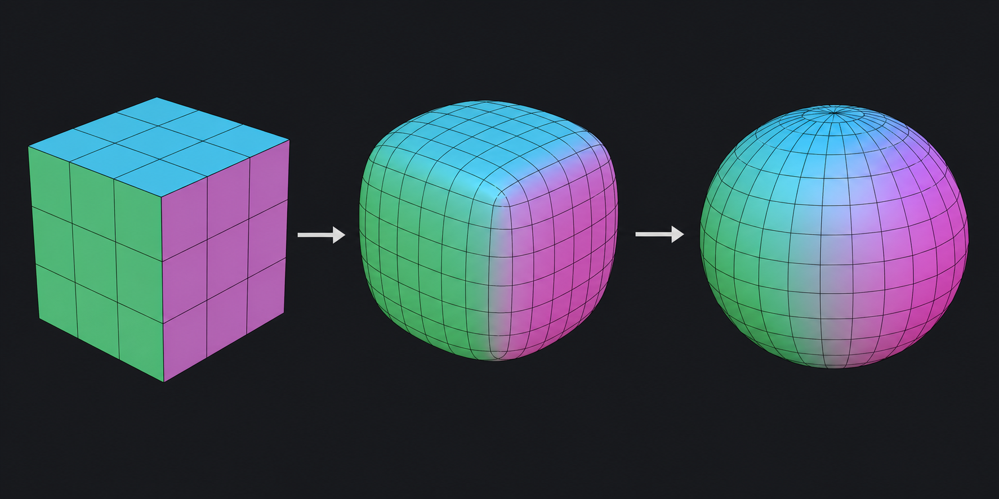

# Quadro-сетка сферы из куба по топологии Catmull–Clark

Статус: `Внедрено`  
Дата фиксации: 2026-09-01  
Компоненты: `BuildSphereCubeQuadMesh`, `CSolid::ReBuldMesh`

## Краткий вывод

Полная сфера строится не как обычная UV-сфера с полюсами и веерами
треугольников. Исходной связностью служат шесть квад-сеток граней куба.
Соседние грани используют общие вершины, после чего вершины переводятся на
сферу равноплощадной проекцией cube-to-sphere. В результате сохраняется
кубическая топология Catmull–Clark: восемь особых вершин имеют валентность 3,
остальные — валентность 4.

Слева направо показаны исходная кубическая связность, её сглаженная форма и
итоговая сфера. Иллюстрация объясняет топологический принцип; фактический код
сразу вычисляет координаты узлов равноплощадной проекцией.

## Алгоритм

1. Каждая из шести граней куба получает одинаковое число разбиений.
2. Узлы на двенадцати рёбрах и восьми углах куба объединяются через общую
   целочисленную решётку. Дублирования вершин между патчами нет.
3. Каждая клетка создаётся четырёхугольником с согласованной внешней
   ориентацией.
4. Координаты куба переводятся на единичную сферу равноплощадной формулой и
   затем масштабируются на радиус исходной OCCT-сферы.
5. Для обрезанной сферической грани готовая кубическая сетка дополнительно
   подрезается по BRep-границе.

`Density` определяет число сегментов на каждой грани куба, но не меняет тип
топологии и не вводит полюс.

## Почему не используется UV-сфера

У UV-сферы меридианы сходятся в двух полюсах. Это создаёт треугольный веер,
сильное изменение размера ячеек и особый шов по долготе. Кубическая схема
распределяет восемь особых вершин симметрично и сохраняет только
четырёхугольные грани.

## Регрессионная проверка

В [`tests/CatalogImportTests.cpp`](../../../tests/CatalogImportTests.cpp)
проверяется полная сфера радиуса 10 при `Density = 0.45`:

- шесть патчей `8 x 8`;
- 386 общих вершин и 384 четырёхугольника;
- каждое ребро принадлежит двум граням;
- ровно восемь вершин имеют валентность 3;
- остальные вершины имеют валентность 4;
- отклонение от заданного радиуса меньше `1e-4`.

Связанный код:

- [`src/solid/Solid.cpp`](../../../src/solid/Solid.cpp) — полная сфера;
- [`src/solid/SurfaceFace.cpp`](../../../src/solid/SurfaceFace.cpp) — сферическая
  грань и подрезка по BRep-контуру.

## История

- 2026-09-01 — зафиксирован принцип построения сферы из куба и добавлена
  иллюстрация.

