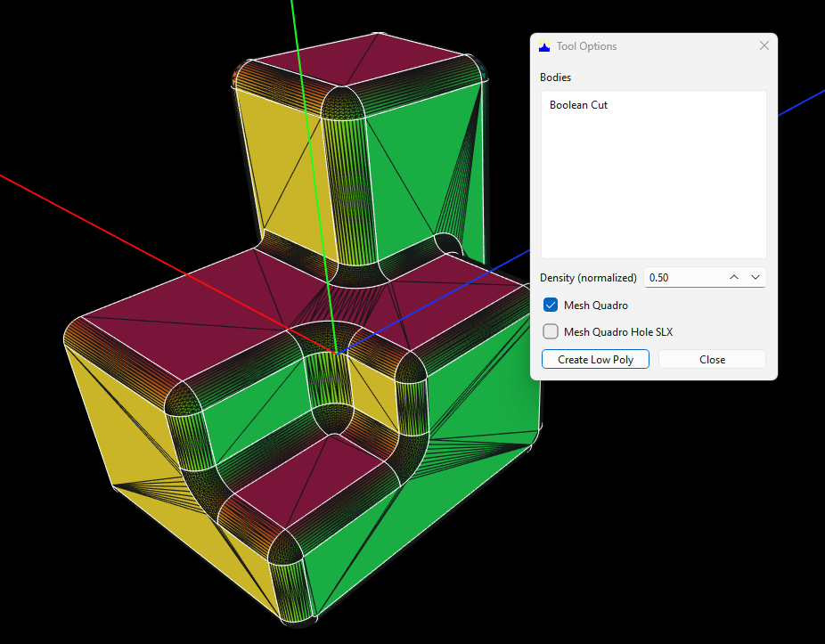
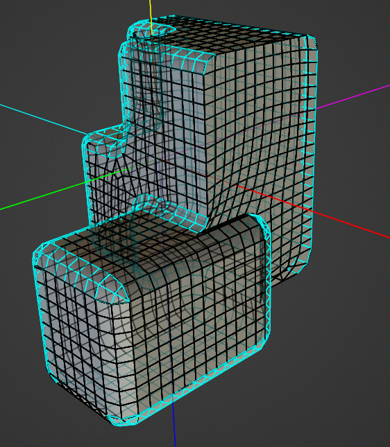
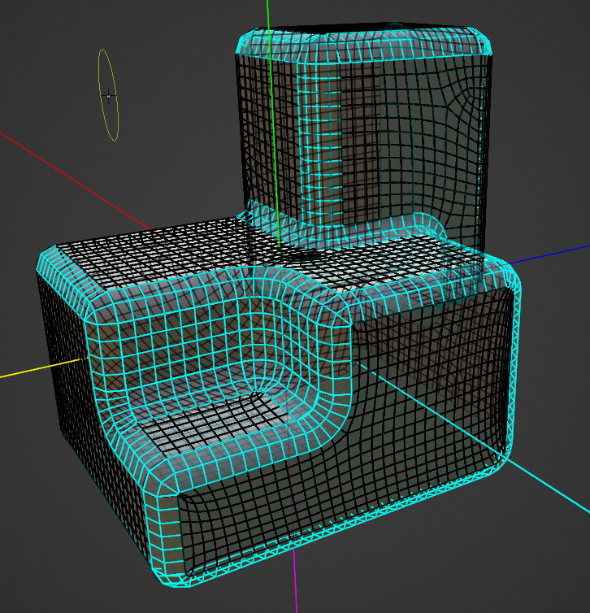
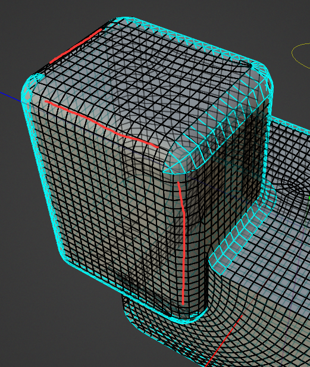

# Boolean_Fill: сингулярные B-Spline-поверхности

Статус: `Исследуется`  
Дата фиксации: 2026-08-27  
Связанные компоненты: `CSolid::BuildQuadroMesh`, `CNet::Build`

## Краткий вывод

Проект `Boolean_Fill.dom3d` является устойчивым регрессионным случаем для Mesh
Quadro. Из 68 поверхностей тела 66 строятся, а поверхности `51` и `66` всегда
остаются пустыми. Отказ повторяется при всех проверенных значениях Density и не
зависит от перестроения дерева операций.

## Условия воспроизведения

- Файл: `tests/data/mesh-regression/Boolean_Fill.dom3d`.
- Тело: `Boolean Cut`.
- Включено: `Mesh Quadro`.
- `Mesh Quadro Hole SLX` выключено.
- Проверенные Density: `0.10`, `0.25`, `0.50`, `1.00`, `1.50`.

При каждом запуске `CSolid::ReBuldMesh` возвращает `false`.

## Подтверждённая диагностика

Обе пустые поверхности имеют одинаковые характеристики:

| Поле | Значение |
|---|---|
| Индексы | `51`, `66` |
| Тип OCCT | `GeomAbs_BSplineSurface` |
| Топологических кромок | `4` |
| Вырожденных кромок | `1` |
| Подготовленных реальных границ | `3` |
| Классификация сетки | `REGULAR_MESH` |
| Итоговый размер сетки | `0 × 0` |
| Результат `CNet::Build` | `3` — не удалось вычислить точку/нормаль |

Вырожденная кромка сводит одну сторону параметрической области B-Spline в
точку. Геометрическая точка поверхности существует, но первая производная или
нормаль на сингулярной UV-границе не определяется обычным способом.
`CSurfaceFace::GetPoint` не может получить устойчивую нормаль даже через
текущий поиск соседних точек, поэтому `CNet` очищает сетку и возвращает ошибку.

## Что не является причиной

- Значение Density: набор проблемных поверхностей не меняется.
- Общая сложность Boolean: остальные 66 поверхностей получают сетку.
- Галочка SLX: проблемные поверхности классифицированы как регулярные и не
  принадлежат ветке отверстий.
- Ошибка перестроения скруглений в дереве операций: для этого теста используется
  уже сохранённая итоговая BRep-геометрия.

## Внешний эталон 3DCoat

Та же итоговая геометрия была экспортирована из Dom3D в STEP и импортирована в
3DCoat. 3DCoat завершил квадро-сетку без пустых поверхностей.

Это является сильным подтверждением двух выводов:

1. STEP-представление формы пригодно для внешнего построителя сетки;
2. сингулярные трёхсторонние патчи допускают завершённую квадро-топологию —
   текущий отказ является ограничением алгоритма Dom3D.

По изображениям видно, что 3DCoat не пытается независимо продолжить на каждом
патче прямоугольную UV-решётку до схлопнутой стороны. Поток рёбер согласуется с
соседними поверхностями, а особые вершины распределяются по общей форме. Это
наблюдение о результате; точный внутренний алгоритм 3DCoat по снимкам определить
нельзя.

### Ограничение регулярности

3DCoat также не получает регулярную решётку на всех зализах и скруглениях.
Красными линиями на следующем снимке отмечены стыки, где равномерные ряды
заканчиваются или перестраиваются в локальную нерегулярную топологию.

На диагностических снимках из 3DCoat голубые линии являются нанесёнными
пользователем аналитическими пометками; их нельзя принимать за автоматически
построенные рёбра сетки или границы BRep.

Следовательно, внешний эталон не требует регулярности на всей модели. Его
полезное свойство — **контролируемая локализация нерегулярности**: сложный стык
не заставляет отказаться от сетки целой поверхности и не создаёт пустого
участка.

Экспорт сохранён рядом с исходным проектом:
[`Boolean_Fill-export.step`](../../../../tests/data/mesh-regression/Boolean_Fill-export.step).

## Ограничение решения

Нельзя возвращать ранее забракованное деление треугольной области на три блока
квадов: оно создаёт заметный маленький «домик» в месте схождения фасок.

Корректное исправление должно отдельно решить две задачи:

1. устойчиво вычислять предельную нормаль в сингулярной точке B-Spline;
2. выбрать приемлемую топологию трёхсторонней поверхности без вырожденного ряда
   квадов и без забракованного трёхблочного патча.

Результат 3DCoat теперь служит визуальным критерием второй задачи. Исправление
Dom3D не обязано повторять каждое ребро буквально и не обязано сохранять
регулярность в сложном стыке. Оно должно сохранять регулярные ряды там, где это
возможно, локализовать особые вершины около зализа, исключать схлопнутые фейсы и
не оставлять поверхность пустой.

До решения второй задачи одного исправления нормали недостаточно: прямоугольная
UV-сетка сможет построиться, но её крайний ряд схлопнется в нулевую площадь.

## Регрессионный статус

Проект сохранён в корпусе:
[`tests/data/mesh-regression`](../../../../tests/data/mesh-regression/README.md).

В `cases.json` зафиксированы контрольная сумма, пять значений Density и текущее
ожидание: перестроение завершается ошибкой, пусты поверхности `51` и `66`.
Статус случая — `known_failure`. После исправления он должен стать `pass` только
после структурной и визуальной проверки результата.

## История

- 2026-08-27 — файл сохранён как первый реальный случай корпуса MeshRegression;
  локализованы две сингулярные B-Spline-поверхности.
- 2026-08-27 — добавлен STEP-экспорт и успешный результат квадрангуляции в
  3DCoat как внешний визуальный эталон.
- 2026-08-27 — уточнено, что 3DCoat использует локально нерегулярную топологию
  на части стыков зализов; зафиксировано значение голубых аналитических линий.
