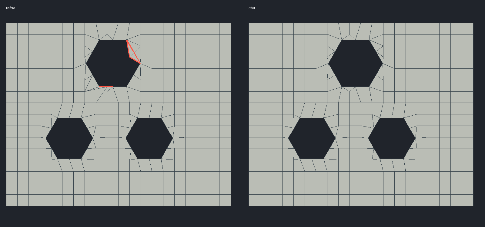

# Boolean-3: конфликт Var-5, Var-7 и Var-8 на одном шве

Статус: `Внедрено`  
Дата: 2026-09-02  
Компонент: `CMesh3D::TrimByPline`

## Воспроизведение

`Boolean-3.dom3d`, тело Boolean Cut, 24 поверхности. Quadro и SLX включены,
Density **0.35**. Плита имеет три сквозных шестиугольных отверстия.
У верхнего отверстия появляется треугольный выступ и несовпадение шва
плоскости со стенкой. В сваренной сетке — **14 открытых рёбер**, четыре
граничных цикла, поверхности 1, 3, 18 и 22.

Ошибка уже присутствует в UV: стенки правильные, но вырезанная граница
плоскости не соответствует исходному контуру. Преобразование UV → XYZ
и допуск сварки не являются причиной.



Слева — исходный результат, справа — исправленный; красным выделены
открытые рёбра сваренного тела на этой стороне. Изображение построено
непосредственно из диагностических OBJ на плотности 0.35.

## Два конфликта

В диагностике одной плоскости на 0.35:

- Ячейка 195 классифицирована как Var-5: внутри неё находится узел контура.
  Соседняя 236 — Var-7, использующий ячейку 195 как вторую грань пары.
  Var-7 выполнялся первым, превращал соседа в треугольники и помечал
  обработанным. Последующий Var-5 пропускался; внутренний узел контура
  терялся, граница срезала угол отверстия.
- Ячейка 285 классифицирована как Var-8, а 286 — как Var-7 с тем же соседом.
  После парного разреза Var-8 использовал локальный номер вершины из
  прежнего четырёхугольника. Изменялась уже другая вершина, и на CAD-шве
  появлялась лишняя точка, которой нет в сетке стенки.

Одна перестановка порядка вариантов не решает эти взаимозависимости.

## Исправление

1. Поиск конфликтов пар Var-7 дополнен случаем, когда занятая ими ячейка
   требует Var-5. Объединённый участок обрабатывается до локальных разрезов.
2. `split_conflicting_trim_cells` допускает одну внутреннюю цепочку исходных
   узлов контура. Собирается общий ориентированный периметр; проверенный
   `SplitFaceByVar11` разделяет его на две части по всей цепочке.
   Изменение транзакционное: неподдерживаемая конфигурация не меняет сетку.
3. Успешный парный разрез отмечает обе исходные ячейки как обработанные
   **в текущем вызове TrimByPline**. Их устаревшие команды больше не
   исполняются. Не используется постоянный флаг как общий запрет обработки
   ячейки при вырезании следующего отверстия.

Используются исходные точки контура, без добавления произвольных узлов
на стыке с CAD-стенками. Density, допуски сварки и выбор SLX не меняются.
Подмены островным алгоритмом или общей триангуляцией нет. Локальные
треугольники остаются допустимой частью существующего алгоритма SLX.

## Безопасность расширения массива граней

Сопутствующий прогон выявил падение `PrismFilletedSlx`. В
`SplitFaceByPoint`, `SplitFaceByPointVar3` и `SplitFaceByPointVar4`
последующие копии исходной грани создавались по старой ссылке после
`faces_.push_back`. При перевыделении массива ссылка уже недействительна.
Теперь грань повторно берётся по индексу. Это не меняет схему разреза.
Изолированный `MeshPointSplitReallocation` принудительно сжимает ёмкость
массива перед разрезом и проверяет все шесть пар вершин четырёхугольника,
положительные площади и сохранение границы.

## Проверка

После исправления на 0.35: **1036 сваренных вершин, 0 открытых рёбер,
0 граничных циклов, манифолдная сетка**. До исправления было 1038 вершин:
две лишние точки находились на противоположных сторонах плиты.

Регрессия `BooleanThreeSlx` проверяет SLX на 0.20, 0.25, 0.30, 0.34,
0.35, 0.36, 0.40, 0.50, 0.70, 0.85, 1.00; затем обычный Quadro на 0.35
и повторное включение SLX на 0.35. Проверяются связность всех поверхностей,
ненулевые ячейки, четыре граничных цикла обеих плоскостей, исходные
CAD-узлы, точная площадь плиты за вычетом трёх шестиугольников и
замкнутая манифолдная сварка.

Итоговый Release-прогон: **21 выбранный регрессионный тест пройден**
(275.59 с), включая предыдущие исправленные модели, проверки сварки,
оба теста перевыделения памяти и `MeshRegressionCorpus`.
Приложение `build/Release/Dom3D_Pro.exe` пересобрано.

```powershell
ctest --test-dir build -C Release -R BooleanThreeSlx --output-on-failure
```

См. также [конфликт двух пар Var-7](slx-shared-var7-cell.md) и
[Var-11 на скруглённой призме](slx-filleted-prism-var11.md).
