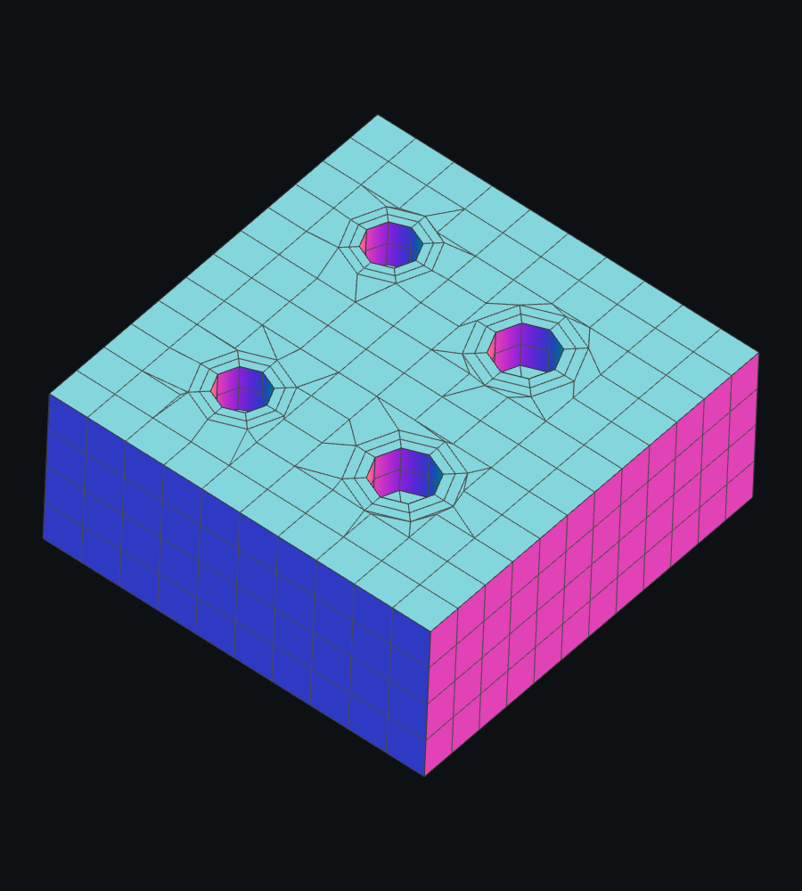
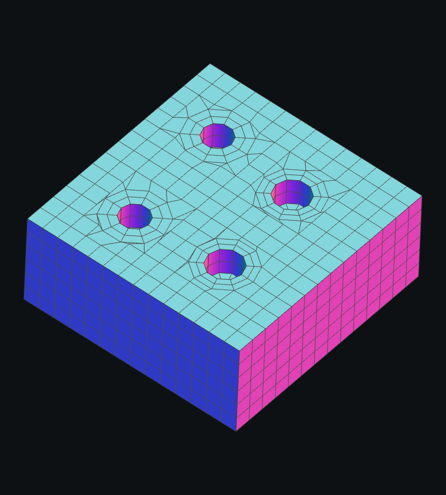

# Box_Min_4_Hole: воротники на крупной сетке

2026-09-03. В модели четырнадцать поверхностей: коробка и четыре глухих
отверстия. На Density 0.20 вокруг окружностей появлялись веера длинных
треугольников, а воротники исчезали. После сварки оставались 18 открытых
рёбер и неманифолдный стык. На 0.25 воротники сохранялись.

## Причина и исправление

SLX удалял целые фоновые ячейки, пересекающие внешние кольца воротников.
При крупном шаге области удаления соединялись: вместо четырёх отдельных
отверстий получалась общая граница. Пришивка колец отвергалась. Следующий
вариант удаления по центрам ячеек оставлял часть фона внутри колец, поэтому
также не мог создать корректную переходную полосу. Последний запасной
путь разрезал фон непосредственно по окружностям, теряя все воротники.

Теперь перед этим запасным путём проверяется пришивка воротников к целым
фоновым ячейкам с исходной шириной и с коэффициентами 0.75, 0.50, 0.25.
Для каждой попытки восстанавливается тот же фон. Внешние кольца получают
столько же узлов, сколько внутренние, чтобы сохранить полные ряды
четырёхугольников. Точные внутренние контуры не перемещаются. На 0.20
успешна половинная ширина: воротники разделены, площадь сохранена,
сварка замкнута. На 0.25 работает исходная ширина.

## Зависимость окружностей от Density

Раньше фиксированный предел углового шага 18° давал минимум 20 сегментов.
Из-за округления вверх и последующего доведения до чётного числа фактически
получались 22 сегмента. Этот минимум перекрывал зависимость малых отверстий
от Density почти во всём диапазоне.

Теперь минимальное число сегментов замкнутой окружности/эллипса — 8,
а угловое разрешение растёт с Density. Для полной окружности угловая часть
правила равна ближайшему сверху чётному числу для `40 * Density`.
Общее правило длины ребра может потребовать больше узлов. Синхронизация
общих CAD-рёбер сохраняет одинаковые узлы на плоскости, стенке и дне.

Для этого файла: 0.20 → 8, 0.25 → 10, 0.30 → 12, 0.35 → 14,
0.40 → 16, 0.50 → 20 сегментов.

## Проверки

`FourHoleCollars` проверяет последовательность 0.20 → 0.25 → 0.30 → 0.35 →
0.40 → 0.50 → 0.25 → 0.20. Проверки включают пять граничных циклов верхней
плоскости, воротник каждого отверстия, положительную площадь каждого
отрисовываемого треугольника, площадь CAD-плоскости с поправкой на вписанные
многоугольники и замкнутую манифолдную сварку.

Тест `HoleLowDensityCollar` теперь проверяет два полных кольца по фактическому
числу сегментов вместо прежнего постоянного порога в 40 четырёхугольников.

Снимки получены через настоящий OpenGL viewport. Локальные треугольники
на переходе от воротников к фоновой сетке остаются.

