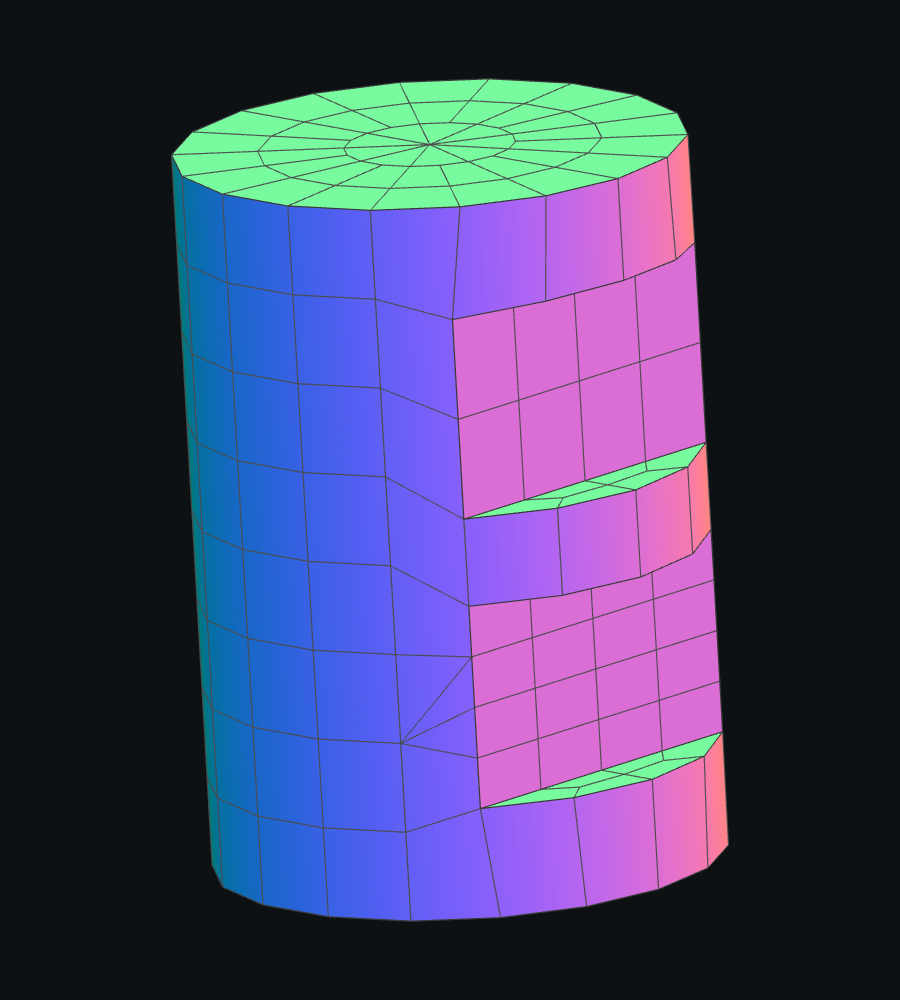

# Cylinder_Min_2_Box: метрическое разрезание цилиндра

2026-09-03. Модель `Cylinder_Min_2_Box.dom3d`, тело Boolean Cut,
девять поверхностей, два близких прямоугольных выреза. Верхняя грань
верхнего выреза слегка наклонена.

На Density 0.40 внешняя сетка давала рёбра длиной до 95.99 при обычном
шаге около 19, шесть центров ячеек попадали в удалённую CAD-область.
После сварки оставались 23 открытых ребра и неманифолдный стык.
На 0.45–0.50 оставались 14 открытых рёбер; 0.80 уже работала правильно.

## Причина

`MakeFilledContour` строил сетку в метрической развёртке цилиндра
`X = R * U, Y = V`, затем возвращал её в UV. Однако `TrimByPline`
получал угловую U и линейную V. Выбор ближайшей вершины в
`PrepareAndMoveVertexToTrimLine` использует евклидово расстояние:
угловое направление оказывалось искусственно сжатым в R раз.
Вершины перемещались к неподходящим узлам контура, растягивая ячейки.

В `BuildFilledMeshWhithHoles` фон, контур и точка сохраняемой стороны
теперь передаются триммеру в одной метрической развёртке. После вызова
координата X возвращается в U. Эта операция применяется также при
повторной обработке точных отверстий после неудачного переходного кольца
или несовпадения площадей. Применение только к первому вызову не решало
ошибку: повторные вызовы снова работали в неметрических UV.

Построитель фоновой сетки и варианты разрезания `TrimByPline` сохранены.
Изменение относится к цилиндрическим отверстиям; плоские поверхности
имеют масштаб U, равный единице.

## Проверка

`CylinderBoxWindows` пересобирает одно тело с выключенным и включённым
SLX на Density 0.35, 0.40, 0.45, 0.50, 0.55, 0.60, 0.65, 0.70, 0.75,
0.80, 0.90, 1.00 и повторно 0.40. Проверяются:

- связность каждой поверхности, корректность индексов и ненулевая площадь;
- центры ячеек на сохраняемой стороне CAD-поверхности;
- максимальное ребро внешнего цилиндра меньше трёх медианных шагов;
- четыре граничных цикла внешнего цилиндра и замкнутая манифолдная сварка.

На 0.40 после исправления максимальное ребро — 28.17, открытых рёбер — 0,
центров ячеек в вырезах — 0. Локальные треугольники около вырезов остаются.



Для визуальной проверки добавлен ручной режим настоящего OpenGL viewport:

```powershell
build/Release/CatalogImportTests.exe --render-project-quadro tests/data/mesh-regression/Cylinder_Min_2_Box.dom3d C:/temp/box-window-
```

Он сохраняет PNG для пяти плотностей и четырёх ракурсов. Каталог назначения
должен существовать; режим требует нативного OpenGL-драйвера.
