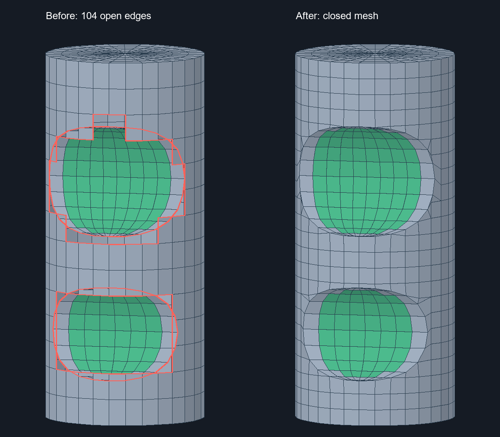

# Cylinder_Min_2_Cylinder: два выреза через шов цилиндра

Дата: 2026-09-03. Статус: исправлено на Density 0.35–1.00;
для 0.20–0.25 остаётся отдельный дефект разрезания крупных ячеек.

## Воспроизведение

Исходная модель: `Cylinder_Min_2_Cylinder.dom3d`, одно тело `Boolean Cut`,
пять поверхностей. На Density 0.50, Quadro и SLX внешняя цилиндрическая
поверхность обрывалась ступеньками у обоих вырезов. После сварки оставались
104 открытых ребра: 52 на внешнем цилиндре, 28 и 24 на внутренних.



Изображение построено из диагностических OBJ на Density 0.50.
Красным отмечены открытые рёбра исходной сетки.

## Причина и исправление

В `CSurfaceFace::BuildTrimmingMesh` прежняя точная обработка цилиндрического окна
включалась только при восьми граничных рёбрах. Два выреза дают двенадцать:
обработка пропускалась, а запасной путь удалял целые ячейки по их центрам.
Теперь признак криволинейного пересечения допускает несколько окон.

В `BuildFilledMeshWhithHoles` устранены ещё два ограничения:

- Повторная вершина в соединённой границе могла замыкать настоящее отверстие,
  за которым шёл отрезок шва туда и обратно. Прежнее удаление любого участка
  A…B…A стирало весь контур верхнего отверстия. Теперь замкнутый обход
  разбирается на циклы; сохраняются циклы с ненулевой площадью.
- Оба окна могут принадлежать одному топологическому проводу CAD. Ограничение
  числа отверстий по `wire_count - 1` оставляло только одно. После переноса
  периодического шва учитывается фактическое число восстановленных контуров.

Для всех окон строится общая развёртка цилиндра. Шаг определяется по рёбрам
всех отверстий, количество делений окружности делается чётным, чтобы торцевые
сетки сохраняли четырёхугольное заполнение. Общий триммер и его варианты
разрезания ячеек не изменены.

## Проверка и границы результата

`CylinderMultipleWindows`: Density 0.35, 0.50, 0.65, 0.80, 1.00 и повторно 0.50,
с выключенным и включённым SLX. Внешняя поверхность имеет четыре граничных
цикла — два торца и два окна. Сваренное тело замкнуто и манифолдно.
На 0.50: 0 открытых рёбер, 1194 вершины после сварки.
В локальном тримминге остаются треугольники; полностью четырёхугольная
топология этим исправлением не заявляется.

На 0.20 точный триммер образует длинные рёбра, результат отвергается прежней
проверкой и используется запасная сетка; остаются 38 открытых рёбер.
На 0.25 остаются 14 открытых рёбер и неманифолдный стык. Эти случаи
зафиксированы отдельно от успешно проверенного диапазона; плотность
программно не ограничивается.

```powershell
ctest --test-dir build -C Release -R CylinderMultipleWindows --output-on-failure
```

