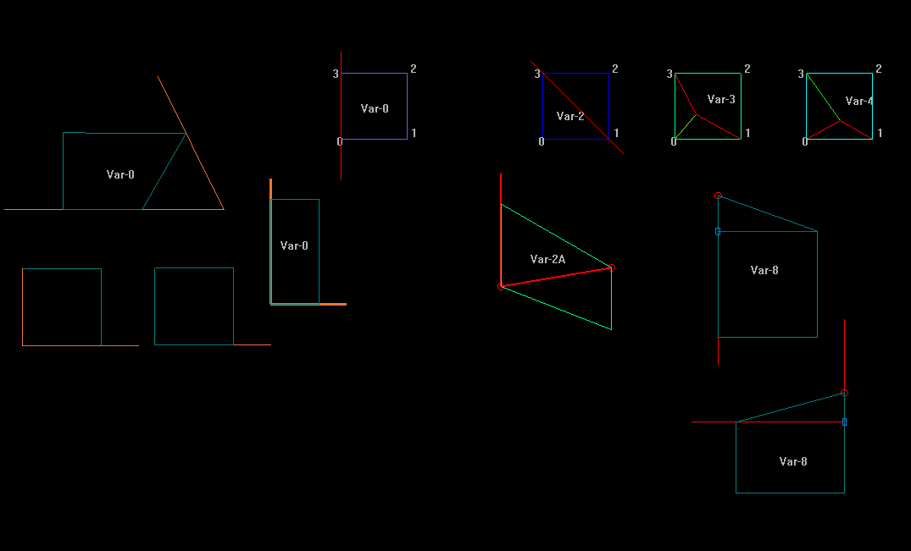
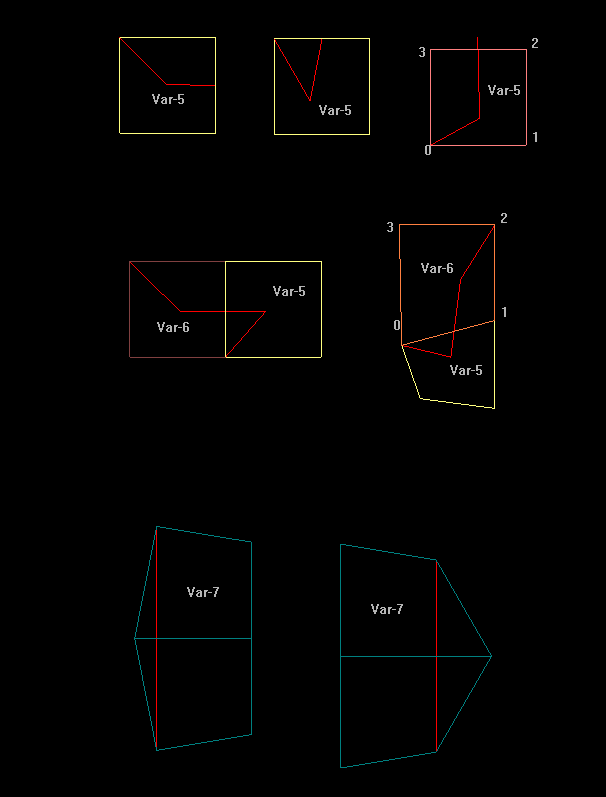
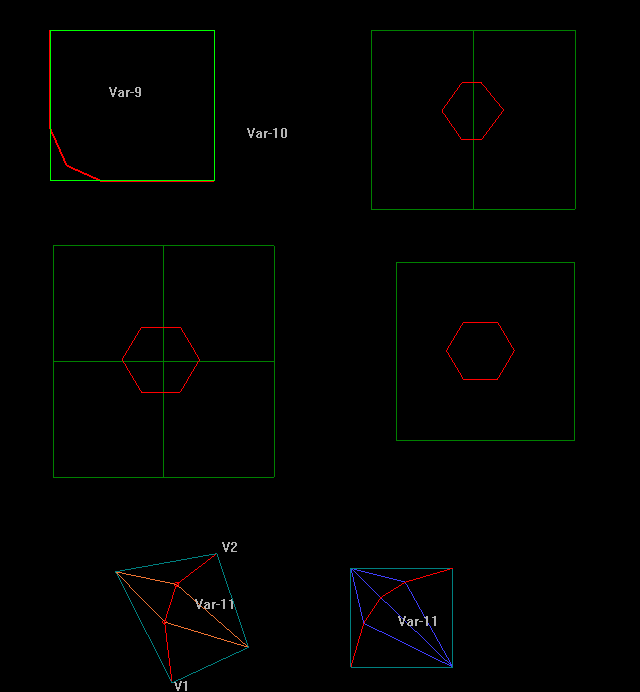

# Варианты локального тримминга ячейки: Var-0 — Var-11

Статус: `Исследуется`  
Дата фиксации: 2026-08-27  
Связанные компоненты: `ClassifyFaceCut`, `CMesh3D::TrimByPline`

## Назначение

Схемы фиксируют авторскую классификацию взаимного положения линии тримминга
и одной либо нескольких ячеек исходной сетки. Номер `Var-N` описывает не
форму конечного фейса, а локальный случай, который должен распознать
`ClassifyFaceCut` и передать соответствующему методу разрезания.

Эти рисунки являются проектным материалом. Надписи на них не означают, что
вариант полностью реализован или проверен в текущем коде.

## Первая группа: Var-0, Var-2, Var-2A, Var-3, Var-4 и Var-8

### Var-0

`Var-0` означает: **ячейку резать не требуется**. На схеме показаны несколько
геометрически разных ситуаций с одинаковым результатом классификации:

- линия проходит вне ячейки;
- линия касается продолжения стороны, не пересекая внутренность;
- затронуты соседние вершины или сторона, но нового разделения площади ячейки
  не возникает;
- ячейка находится целиком на сохраняемой стороне.

Это полноценный результат классификации, а не ошибка и не «неизвестный
вариант».

### Var-2 и Var-2A

На схеме показан прямой проход линии между двумя граничными точками. Обозначение
`Var-2A` служит геометрическим подвариантом на рисунке; отдельного значения
`VariantCut == 2A` в коде нет.

### Var-3 и Var-4

Линия приходит к внутренней точке ячейки и требует разбиения вокруг этой
точки. В текущей реализации `Var-4` не выдаётся классификатором как отдельное
число: это внутренняя топологическая ветка `SplitFaceByPoint`, выбираемая по
расположению двух индексов вершин.

### Var-8

Линия проходит достаточно близко к вершине, чтобы вместо образования малого
фейса переместить выбранную вершину на линию тримминга. Текущая ветка кода —
`SplitFaceByVar8`.

## Вторая группа: Var-5, Var-6 и Var-7

### Var-5

`Var-5` обрабатывает **сразу два соседних фейса**. Это принципиальная часть
контракта варианта: его нельзя оценивать как независимое разрезание только
одной ячейки. Текущая ветка кода — `SplitFaceByVar5`.

### Var-6

`Var-6` **не закончен** и работает в связке с `Var-5`. Самостоятельный вызов
или тест только одного фейса не является корректной проверкой этого случая.
Перед дальнейшей разработкой нужно зафиксировать:

1. какой из двух соседних фейсов классифицируется как `Var-5`;
2. какой — как `Var-6`;
3. общую кромку и порядок обработки пары;
4. ожидаемую топологию обоих фейсов после единой операции.

В коде присутствует `SplitFaceByVar6`, но наличие функции не означает
завершённость алгоритма.

### Var-7

Случай проходит через вершину и противоположную сторону либо требует
согласованной обработки пары соседних ячеек. Текущая ветка кода —
`SplitFaceByVar7`; её корректность должна проверяться на обеих показанных
конфигурациях.

## Третья группа: Var-9, Var-10 и Var-11

### Var-9 и Var-10

К реализации `Var-9` и `Var-10` работа ещё не начиналась. Схемы фиксируют
требуемые случаи:

- контур входит в ячейку и выходит через соседнюю сторону, оставляя несколько
  внутренних точек;
- замкнутый контур целиком расположен внутри одного фейса;
- замкнутый контур пересекает границы двух или четырёх соседних фейсов.

В текущем `ClassifyFaceCut` значения `9` и `10` не назначаются, а в
`TrimByPline` нет соответствующих веток выполнения. До реализации эти случаи
должны диагностироваться явно, а не незаметно подменяться другим вариантом.

### Var-11

Вариант содержит две затронутые вершины фейса и несколько точек линии внутри
него. Текущая ветка кода — `SplitFaceByVar11`. На схемах показаны две возможные
формы исходной ячейки и порядок внутренних сегментов.

## Состояние вариантов

| Вариант | Смысл или состояние | Отражение в текущем коде |
|---|---|---|
| `0` | Резать не нужно | Результат `ClassifyFaceCut`, ветки разрезания нет |
| `2` | Прямой разрез между двумя граничными точками | `SplitFaceByLine` |
| `2A` | Подвариант авторской схемы | Отдельного номера в коде нет |
| `3` | Разрез с внутренней точкой | `SplitFaceByPoint` |
| `4` | Топологический подвариант Var-3 | Внутри `SplitFaceByPoint` |
| `5` | Совместная обработка двух фейсов | `SplitFaceByVar5` |
| `6` | Связан с Var-5, не закончен | `SplitFaceByVar6` присутствует |
| `7` | Проход через вершину и сторону | `SplitFaceByVar7` |
| `8` | Перемещение близкой вершины на линию | `SplitFaceByVar8` |
| `9` | Не реализован | Классификации и обработчика нет |
| `10` | Не реализован | Классификации и обработчика нет |
| `11` | Несколько внутренних точек | `SplitFaceByVar11` |

## Требования к диагностике и тестам

Для каждой обработанной ячейки регрессионный тест должен записывать:

- распознанный `VariantCut`;
- идентификатор исходного фейса;
- точки пересечения границы и внутренние точки;
- соседний фейс для связанных вариантов;
- сетку непосредственно до и после локального разрезания.

`Var-0` считается успешным результатом только когда площадь ячейки действительно
не пересечена линией. Для `Var-5` и `Var-6` единицей тестирования является пара
фейсов. Для `Var-9` и `Var-10` до появления реализации тест должен сообщать
«вариант не реализован», а не принимать повреждённую сетку.

Набор моделей для автоматического тестирования Mesh Quadro должен включать по
крайней мере один воспроизводимый пример каждого варианта. Помимо структурных
проверок нужен эталонный снимок сетки: формально валидные квады могут образовать
визуально неприемлемую топологию.

## Связанные материалы

- [Карта метода `CMesh3D::TrimByPline`](trim-by-pline.md)
- Реализация классификатора: [`src/Line2D.cpp`](../../../../src/Line2D.cpp)
- Реализация вариантов: [`src/CMesh3D.cpp`](../../../../src/CMesh3D.cpp)
- Объявления методов: [`src/CMesh3D.h`](../../../../src/CMesh3D.h)

## История

- 2026-08-27 — добавлены исходные схемы и зафиксированы состояния `Var-0`,
  связки `Var-5`/`Var-6`, а также не начатых `Var-9`/`Var-10`.
